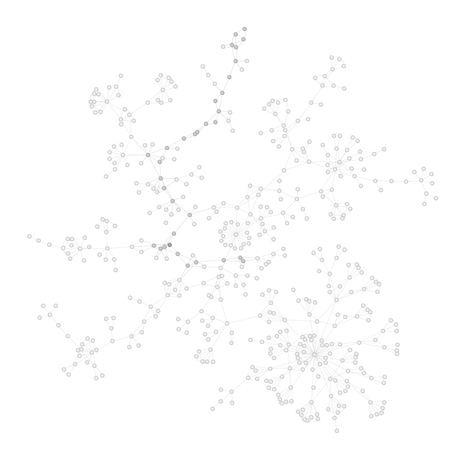

- [About](#about)
- [Quickstart instructions](#quickstart-instructions)
- [In-depth guide](#in-depth-guide)
- [Color palettes and selection](#color-selection-and-palettes)
- [Examples](#examples)
  - [Custom color examples](#custom-color-examples)

## About

[ASTRAviewer](https://astraviz.streamlit.app/) is a web app that
displays a “star map” like network visualization from family trees
stored as GEDCOM files.

## Quickstart instructions:

1.  Click the “**Add GEDCOM**” section in the sidebar menu and **upload a
    GEDCOM file** (if you do not have one, you can use one of the provided
    examples).

2.  Select a type of **view** (**2D** or **3D**) from the drop down menu.

3.  Press the “**Generate Network**” button.

Upon data processing and network generation you will be able to interact
with the visualization.

Please be patient while the network loads – time increases with the
number of individuals and connections. In 2D, after generation the
network goes through a physics simulation and nodes can also be moved to
wield better separations.

## In-depth guide:
In-depth Guide:

1. Click the "**Add GEDCOM**" section in the sidebar menu.

2. **Upload a GEDCOM** file (or one of the provided examples).

    - If the file was parsed correctly a success message will appear.

3. Select a type of **view** (the classic **2D** or the new **3D** visualization) from the dropdown menu.

4. Customize the network at your own will:

    - **Highlights**
      - Consider if you want to **highlight a specific individual** as your **root/reference** and select them from the menu. Uncheck the box in case you do not.
      - If you want to **call attention to one additional person**, press "**Highlight another individual**" and select them from the drop down list.
      - You can also emphasize the **ancestors** of your selected reference in a different color (this option will not be available if you do not want a reference).

    - **Colors**:
      - Choose a preset color palette (between Classic, Pastel, Nightly, Grayscale, or Colorblind-friendly), or
      - You can pick a color that bests suits your taste for each of the highlighted options mentioned previously.

6. Press the "**Generate Network**" button.

With the completion of data processing and network generation, users will have the capability to engage with the visualization interface.

For 2D networks a physics simulation will be performed in order to yield better separations, the user is also able to manually displace nodes.

3D networks are positionally static (defined by a layout algorithm), the user is able to zoom in and out at will and rotate it in any direction.

## Color selection and palettes

There are five standard color palettes one can use in the application:
Classic, Pastel, Nightly, Grayscale, Colorblind-friendly (Tol light),
with default color values for the background, individuals’ general
color, root individual color, highlight individual color, and ancestor
color. Nevertheless the user is free to use any of these as a base and
change these options to any color they find suits their visualization better.

## Examples

|                   2D                    |                   3D                    |
|:---------------------------------------:|:---------------------------------------:|
|      |      |
|        |        |
|      |      |
|  |  |
|  |  |

### Custom color examples

|                           |                         |                         |
|:-------------------------:|:-----------------------:|:-----------------------:|
|  |  |  |
